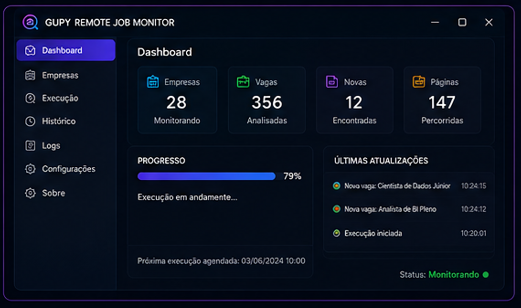
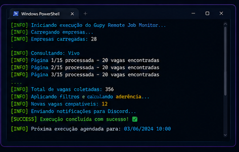
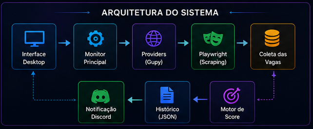
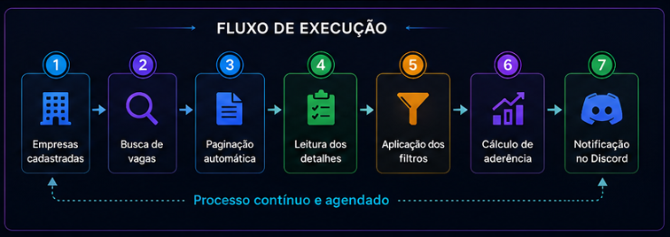

<p align="center">
  
</p>

# 🚀 Gupy Remote Job Monitor

Aplicação desktop desenvolvida em Python para monitorar, analisar e classificar automaticamente vagas remotas relacionadas a Dados, BI, Analytics, Engenharia de Dados e Machine Learning.

O sistema percorre páginas públicas de empresas na Gupy, analisa as oportunidades encontradas, calcula a aderência ao perfil profissional e envia notificações estruturadas para o Discord.

> Este repositório é uma apresentação de portfólio.  
> A implementação completa, os filtros e os mecanismos internos permanecem privados.

---

## 🎯 Problema resolvido

A busca manual por vagas exige acessar várias páginas, revisar oportunidades repetidas e identificar quais posições realmente combinam com o perfil profissional.

O Gupy Remote Job Monitor automatiza esse processo:

1. Consulta as empresas cadastradas.
2. Percorre automaticamente todas as páginas de vagas.
3. Analisa títulos e descrições.
4. Descarta oportunidades incompatíveis.
5. Calcula um score de aderência.
6. Evita notificações duplicadas.
7. Envia novas oportunidades para o Discord.

---

## ✨ Principais funcionalidades

- Monitoramento de múltiplas empresas.
- Cadastro e remoção de empresas pela interface.
- Paginação automática das páginas da Gupy.
- Filtro exclusivo para vagas remotas.
- Exclusão de vagas híbridas e presenciais.
- Exclusão configurável de oportunidades incompatíveis.
- Motor de pontuação por aderência técnica.
- Classificação visual por estrelas e percentual.
- Identificação automática de senioridade.
- Identificação de tecnologias, benefícios e salário.
- Histórico para evitar notificações duplicadas.
- Notificações em cartões pelo Discord.
- Interface gráfica desktop.
- Logs detalhados de execução.
- Agendamento automático pelo Windows.
- Empacotamento como executável.

---

## 🖥️ Interface

<p align="center">
  
</p>

---

## 🔔 Notificação no Discord

<p align="center">
  
</p>

---

## ⚙️ Execução do monitor

<p align="center">
  
</p>

---

## 🏗️ Arquitetura

<p align="center">
  
</p>

---

## 🔄 Fluxo de execução

<p align="center">
  
</p>

---

## 🧰 Tecnologias utilizadas

- Python
- Playwright
- Requests
- Beautiful Soup
- CustomTkinter
- Discord Webhooks
- PyInstaller
- JSON
- Git e GitHub
- Windows Task Scheduler

---

## ⭐ Exemplo de classificação

```text
Cargo: Cientista de Dados Júnior
Senioridade: Júnior
Aderência: 95%
Score: 420 pontos

Termos identificados:
- Cientista de Dados
- Python
- SQL
- Power BI
- Machine Learning
- ETL
```

---

## 💡 Decisões técnicas

A solução foi dividida em módulos responsáveis por:

- coleta e paginação das vagas;
- processamento e normalização dos textos;
- aplicação de filtros;
- cálculo de aderência;
- controle do histórico;
- envio de notificações;
- interface gráfica;
- leitura de configurações externas.

Essa separação facilita a manutenção, os testes e a futura inclusão de outras plataformas de recrutamento.

---

## 📌 Próximas evoluções

- Suporte a outras plataformas de recrutamento.
- Editor visual de filtros e pontuações.
- Notificações nativas do Windows.
- Melhorias no painel de acompanhamento.
- Distribuição por instalador para Windows.

---

## 🔒 Privacidade do código

O código-fonte completo não está disponível publicamente.

Este repositório apresenta apenas funcionalidades, arquitetura, decisões técnicas, interface e resultados obtidos.

Os algoritmos de coleta, os filtros completos e as regras de classificação permanecem em um repositório privado.

---

## 👨‍💻 Autor

**Victor Vinny Braz**

Profissional de Dados e BI com quase 6 anos de experiência em projetos no setor de telecomunicações.

**Principais competências:**

- SQL Server
- Power BI e DAX
- Python
- SAS
- ETL
- Indicadores e dashboards
- Automação de processos
- Machine Learning